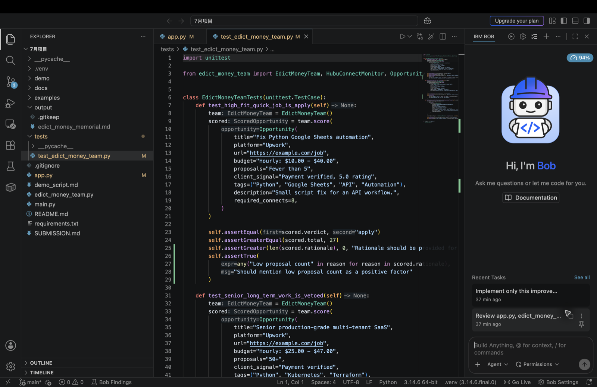
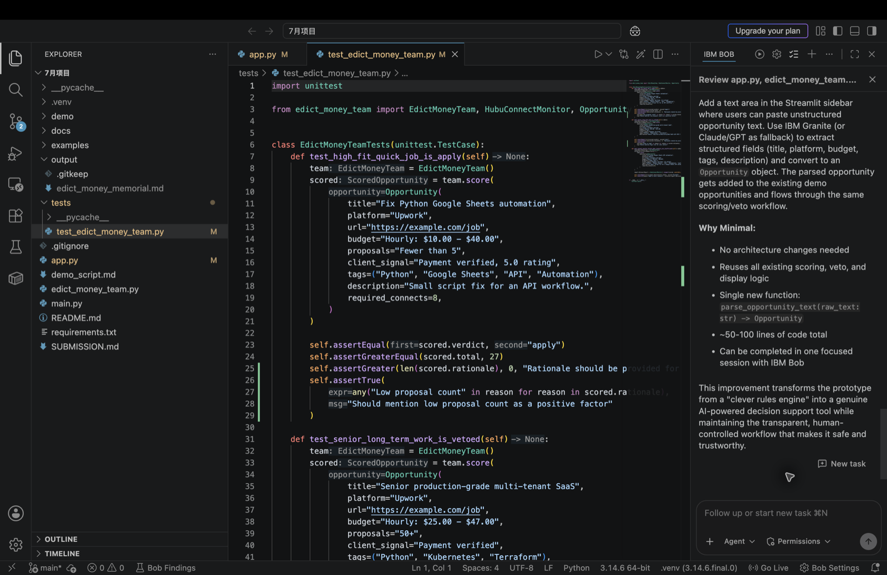

# Edict Work Mode

Edict Work Mode is an IBM AI Builders Challenge July 2026 wildcard prototype for intelligent work decision support.

The app helps a user evaluate work opportunities before spending time, proposal credits, or reputation. It scores opportunities, blocks bad fits, checks resource constraints, and produces a concrete action plan.

## IBM Technology Evidence

This project uses IBM Bob as the primary IBM AI-supported development tool. Bob was used to review the architecture, identify the opportunity parsing improvement, and prepare challenge-ready documentation.





## Challenge Fit

- Challenge: AI Builders Challenge with IBM Bob, July 2026
- Selected theme: Wildcard Challenge, Build Intelligent Systems for the Future of Work
- Focus: workflow automation, decision intelligence, and human-approved AI co-worker behavior

## Problem Statement

Students and early-career builders often face noisy opportunity pipelines: freelance projects, internships, AI evaluation work, automation tasks, and remote roles. Applying everywhere wastes time and can create reputation risk.

The problem is not only finding opportunities. The harder problem is deciding which ones are safe, realistic, worth pursuing, and aligned with current proof of skill.

## Solution

Edict Work Mode turns opportunity review into a structured decision workflow.

It:

- Scores opportunities by fit, speed, trust, money, and risk.
- Parses pasted opportunity text into structured fields for scoring.
- Vetoes unrealistic or unsafe work before action.
- Checks whether proposal credits/connects are sufficient.
- Produces recommended next actions.
- Keeps final submission, spending, and client communication under human approval.

## AI Approach and Architecture

The prototype models an AI-assisted "court" workflow. Each department has a narrow responsibility:

```text
User mandate
  -> 太子: classify the request
  -> 早朝官: gather opportunity intelligence
  -> 中书省: rank and plan
  -> 门下省: veto bad work
  -> 尚书省: dispatch execution
  -> 户部: budget and connects
  -> 礼部: proposals and communication
  -> 兵部: implementation
  -> 工部: deployment and operations
  -> 刑部: compliance and safety
  -> 吏部: reputation and portfolio proof
```

The current proof of concept uses deterministic Python scoring rules so every decision can be inspected. Future versions can add IBM Granite or another language model layer for opportunity parsing and proposal drafting, while keeping the same human approval gates.

The pasted-text parser is intentionally local and transparent for the demo. It extracts common fields such as platform, budget, proposal count, client signal, skills, and required connects without sending private opportunity text to an external service.

## IBM Bob Usage

IBM Bob is the primary IBM AI-supported development tool used for this July challenge prototype.

Bob was used to:

- Review `app.py`, `edict_money_team.py`, and `README.md`.
- Explain the current architecture and challenge fit.
- Identify strengths, limitations, and weak assumptions in the prototype.
- Recommend one high-impact, minimal next improvement: adding opportunity parsing while reusing the existing scoring and veto workflow.
- Keep file changes human-approved instead of letting the assistant submit or spend anything automatically.

The evidence screenshots are shown near the top of this README and saved in `docs/images/`.

## Project Structure

```text
.
├── app.py                    # Streamlit prototype
├── edict_money_team.py       # Decision workflow and scoring logic
├── main.py                   # Command-line demo
├── examples/sample_memorial.md
├── docs/edict_money_mode.md
├── tests/test_edict_money_team.py
├── requirements.txt
└── SUBMISSION.md
```

## Quick Start

Create and activate a virtual environment:

```bash
python3 -m venv .venv
source .venv/bin/activate
python -m pip install --upgrade pip
pip install -r requirements.txt
```

Run the command-line demo:

```bash
python main.py --demo --connects 20
```

Run tests:

```bash
python -m unittest discover -s tests -p "test*.py" -v
```

Run the Streamlit prototype:

```bash
python -m streamlit run app.py
```

## Safety and Privacy

- The public repo uses sanitized example opportunities.
- Real application logs, resumes, private notes, and proposal drafts must stay out of Git.
- The system does not submit proposals or spend proposal credits automatically.
- Human approval is required before any external action.

## Limitations

This is a proof of concept. The current scoring and parsing rules are transparent but simple. It does not yet import real platform data, parse arbitrary job descriptions with an LLM, draft final proposals, or connect to external services.

## Future Improvements

- Add CSV/JSON import for opportunity snapshots.
- Add an IBM Granite or other LLM-powered parser for unstructured opportunity text.
- Add proposal drafting with mandatory human approval.
- Add a persistent opportunity board.
- Add a richer web dashboard and explainability view.
- Add final demo video materials.
